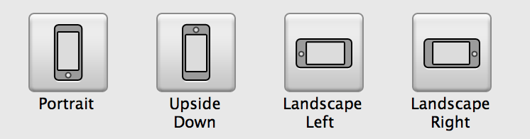
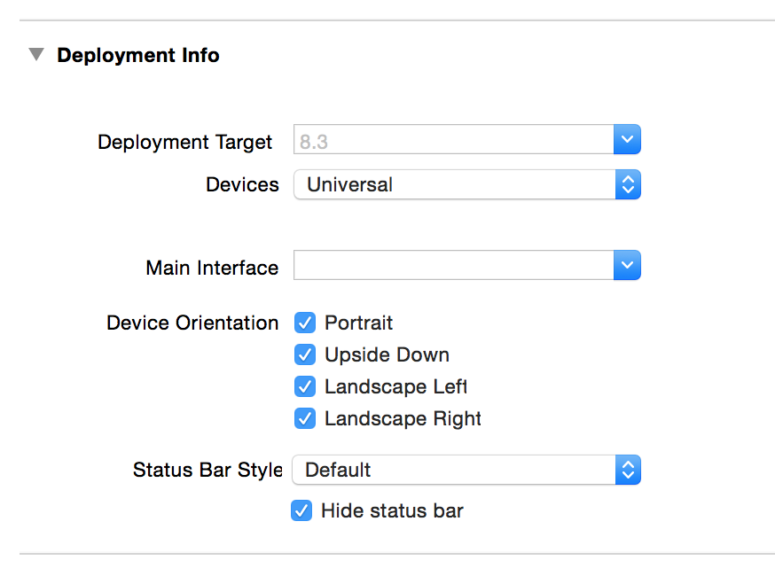

# Rotation, Modal, Popover Demo

This demo apps serves to help demonstrate some iOS APIs and patterns including: device rotation, modal view controller presentation and popover presentation.

## Instructions

### Rotation

Explain how there a concept called allowed device orientations. Consider using this old visual to help explain the positioning of the home button related to the device orientation values:

Then show off how you allow/disallow these in project settings:

Demo rotation in the simulator. Explain that when a view is rotation it should be considered a width/height change and not much more.

### Modal

Explain and demo modal presentation, it's uses (login forms, new items, etc) and how it has completion closures. 

Explain the concepts of `presentingViewController` and `presentedViewController` properties on `UIViewController`.

Explain and demo dismissal. (Extra: talk about using delegates for better responsibility separation).

Explain and demo how a modal presentations can have any number of `modalPresentationStyle`s. (Most only make a meaningful difference on iPad). Be sure to note you set this on the view you are presenting (not the presenter!).

Explain and demo how a modal presentations can have any number of `newVC.modalTransitionStyle`s.

### Popovers

Explain and demo the `modalPresentationStyle` `Popover`. 

Show it as a popover (iPad) and then as a modal (iPhone).

## Notes

The app is intentionally `XIB` based as we currently present these concepts before storyboards in our iOS class syllabus. 

